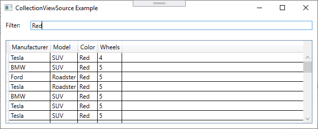

# CollectionViewSource Example

## Introduction

In this example we want to filter data in a DataGrid.

This is a trivial example without MVVM and other best practices.

## Screenshot



## Walkthrough this example

First, we are creating in `Window` a Resources with the Name `ViewModel` from type `ViewModel`.

```xml
<Window
    xmlns:local="clr-namespace:CollectionViewSource">

<Window.Resources>
    <local:ViewModel x:Key="ViewModel" />
</Window.Resources>
```

This `StaticResource` is set as `DataContext` in `Grid`, so that we have access to all `publi`c member of class `ViewModel`.

```xml
<Grid DataContext="{StaticResource ViewModel}">
```

The property `FilterValue` from `ViewModel` is set as `Binding` in this `TextBox`. This will be used to enter the text which we will used to filter.

```xml
<TextBox
    Grid.Row="0" Grid.Column="1"
    Margin="10"
    Text="{Binding FilterValue, UpdateSourceTrigger=PropertyChanged, Delay=100}" />
```

The property `Cars` from `ViewModel` is set as `Binding` in this `DataGrid`. This property contains the filtered data.

```xml
<DataGrid
    Grid.Row="1" Grid.Column="0" Grid.ColumnSpan="2"
    Margin="10"
    ItemsSource="{Binding Cars}" AutoGenerateColumns="True" IsReadOnly="True" />
```

The class of Car is a trivial object.

```csharp
public class Car
{
    public string Manufacturer { get; set; }
    public string Model { get; set; }
    public string Color { get; set; }
    public int Wheels { get; set; }
}
```

We are creating 100 instances of Car ...

```csharp
var cars = Enumerable.Range(0, 100).Select(i => Car.CreateRandom());
```

... and with GetDefaultView we are creating an `ICollectionView` which contains all of these 100 instances. This will be the public property that we will bind to the GridView.

```csharp
var collectionView = System.Windows.Data.CollectionViewSource.GetDefaultView(cars);
this.Cars = collectionView;
```

Zo CollectionView.Filter we assign the method which implements the filter, this must be a predicate.

```csharp
collectionView.Filter = Filter;
```

This public property is bind to the `TextBox` where the filter value will be entered. `set_FilterValue` container `this.Cars.Refresh();` which will trigger the filter process.

```csharp
public string FilterValue
{
    get => filterValue;
    set
    {
        filterValue = value;
        this.Cars.Refresh();
    }
}
```

This method will be called from `ICollectionView` when `this.Cars.Refresh();` is called. It returns `true` if we want to see the object and `false` if we want to filter the object.

```csharp
private bool Filter(object obj)
{
    var car = obj as Car;
    if (car == null)
        return false;

    if (String.IsNullOrWhiteSpace(this.FilterValue))
        return true;

    if (car.Manufacturer.Contains(FilterValue, StringComparison.InvariantCultureIgnoreCase))
        return true;
    if (car.Model.Contains(FilterValue, StringComparison.InvariantCultureIgnoreCase))
        return true;
    if (car.Color.Contains(FilterValue, StringComparison.InvariantCultureIgnoreCase))
        return true;
    if (car.Wheels.ToString() == this.FilterValue)
        return true;

    return false;
}
```
